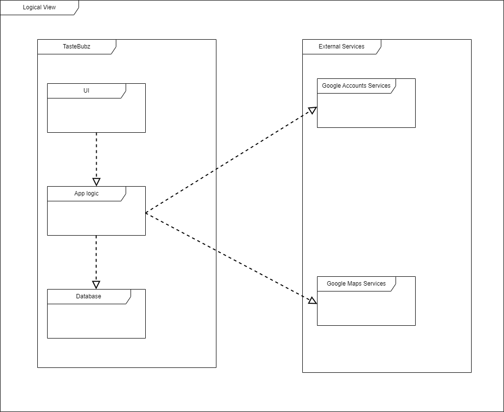
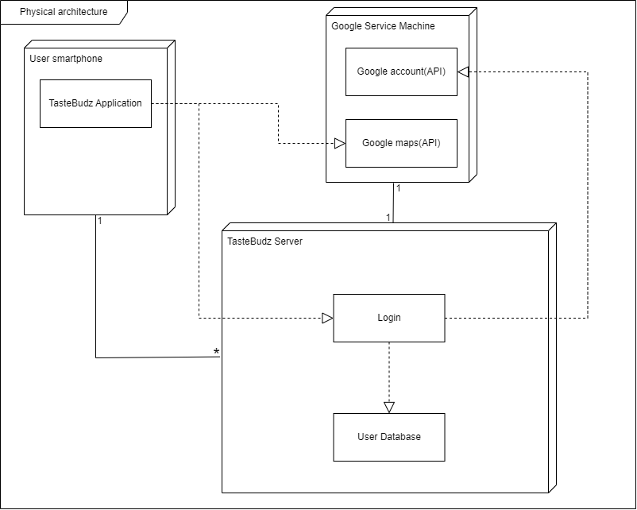

# Architecture and Design

## Logical architecture

  

- `UI`: Observing the application;
- `App Logic`: Administration of user data;
- `DataBase`: Storage of user information;
- `Google account services`: Retrieving information to authenticate user;
- `Google maps services` : Retrieving information to assist the user.

## Physical architecture
   
   The user interacts with the application using their own smartphone. The application then interacts with the Google maps API and the server that contains the user data. 
   
   Login with google is a feature we intend on adding, so the server must interact with Google Sign-in Plugin.

  

## Vertical prototype

