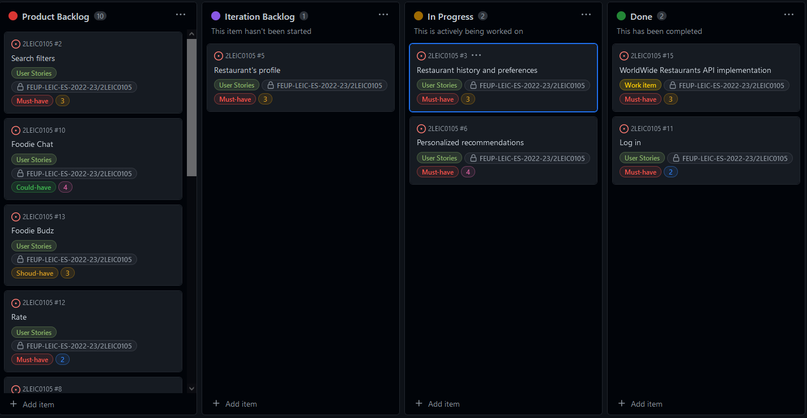

# Release
https://github.com/FEUP-LEIC-ES-2022-23/2LEIC0105/releases/tag/v0.3.0

# Sprint Retrospective

## What went well?
 
 - Most task completed in time;
 
## What didn't go so well?

- Communication;
- Bad work distribution;

 ## What have I learned?

- More accustomed to flutter
- 

 ## What still puzzles me?

- Gherkin aceptance tests
- Unit testing
 
 # Project Board
 

  

 
 
